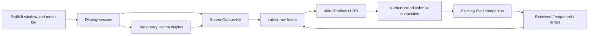

# Mac host architecture

## Capture and encoding

Capture produces an SDR Rec.709 image at the iPad's native resolution. Mirror
mode preserves the source aspect ratio. Extend mode creates a display with a
native pixel backing store and half-sized Retina desktop coordinates. Standard
scaling is also available. The cursor is included; audio is disabled.

ScreenCaptureKit delivers buffers on one serial capture queue. That queue owns
encoder state and retains only the latest raw image while a frame is in flight.
After the receiver acknowledges a frame, encoding of the latest pending image
starts immediately. Discarding superseded raw buffers preserves the encoded
reference chain; discarding arbitrary encoded P frames would break it.

The hardware option requires hardware H.264. The low-latency option selects
Apple's real-time rate-control encoder (software on the tested Mac). Both use
real-time encoding, no B frames, no internal frame delay where supported, and an
IDR at least once a second. At 60 fps the speed-priority hint is enabled. Actual
hardware use and encoder identity are queried and reported, not assumed.
The encoder's AVCC samples are prefixed with SPS/PPS at every IDR. A receiver
enqueue stall forces another IDR, allowing it to recover from a flushed queue.

A serial USB worker performs complete writes and reads exactly one 16-byte
acknowledgment before another frame enters the encoder. Socket deadlines bound
unresponsive connections. A one-second encoded keepalive handles static desktop
content, which ScreenCaptureKit does not continuously refresh. Failure to obtain
an initial screen frame is detected. Captured images and encoded bytes are not
written to disk.

## USB and pairing

The host speaks the usbmux plist protocol directly to `/var/run/usbmuxd`, and
filters discovery to USB connections. Every connection re-resolves the chosen
device identifier; it never silently switches to a different iPad. Protocol
headers and payload lengths are bounded before allocation.

OpenSSH uses the app executable's `--usbmux-proxy` mode for setup and launch.
Arguments are passed as arrays, and ProxyCommand words and the installed public
key are shell-quoted. The askpass subprocess reads a short-lived mode-0600 file;
the password is never placed in command-line arguments. SSH diagnostics and
tokens are not printed into application logs.

## Ownership and cleanup

The main actor owns the display session, ScreenCaptureKit stream, virtual
display owner, and app controls. A separate capture queue owns the encoder, and
the USB worker is the only streaming socket writer. Cancellation first marks
the pipeline stopped, then shuts down the socket. Its descriptor is closed
only when its owner is released, avoiding descriptor reuse during blocked I/O.

Startup acquires a lock, checks capture access, authenticates USB, creates the
encoder, and starts the selected source. The virtual display is positioned only
after WindowServer publishes it to ScreenCaptureKit. Every failure path stops
capture and releases the virtual display. The main actor remains responsive
while SSH and USB operations run on workers. Window close leaves the menu bar
app running; Stop, Quit, sleep, removed-display detection, and stream failure
release the session. Display ownership also ends on process exit.

The private CoreGraphics bridge declares only the selectors it needs, resolves
classes at runtime, catches incompatible selectors, and never disables or
mirrors a physical monitor. Display identity uses a stable per-device hash to
avoid accumulating ColorSync profiles. It changes only the origin of its own
display, with session-scoped configuration.

## Source references

- [Apple: Capturing screen content in macOS](https://developer.apple.com/documentation/screencapturekit/capturing-screen-content-in-macos)
- [Apple: SCStreamConfiguration](https://developer.apple.com/documentation/screencapturekit/scstreamconfiguration)
- [Apple: VideoToolbox](https://developer.apple.com/documentation/videotoolbox)
- [Apple: Low-latency VideoToolbox encoding](https://developer.apple.com/videos/play/wwdc2021/10158/)
- [Chromium: virtual display API declarations and HiDPI behavior](https://chromium.googlesource.com/chromium/src/+/HEAD/ui/display/mac/test/virtual_display_util_mac.mm)
- [Original companion and shared protocol](https://github.com/cevatkerim/ipad-screen)
